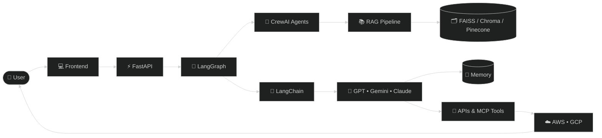

## 💡 AI Quote

# 👋 Hi, I'm Sonu Kumar

### Agentic AI Engineer | Python | Generative AI | Conversational AI

I build AI-powered applications using LangGraph, LangChain, OpenAI, FastAPI, and Python.

Currently building intelligent AI agents, desktop assistants, and enterprise AI solutions.

## 🚀 Current Focus

- 🤖 Agentic AI
- 🧠 Multi-Agent Systems
- 📚 Retrieval-Augmented Generation (RAG)
- 💬 Conversational AI
- 🖥️ AI Desktop Assistants
- ⚡ MCP

# ⚡ Tech Stack

---

# 🤖 Agentic AI & Generative AI

---

# 🧠 LLMs

---

# 📚 AI Frameworks

---

# ☁️ Cloud & Deployment

---

## 🧠 AI Ecosystem

# 🚀 Featured Projects

| Project | Description |
|----------|-------------|
| 🧠 EchoMind | AI Desktop Assistant with Voice, Memory & Multi-Agent Workflows |
| 🤖 Agentic AI Projects | LangGraph + CrewAI + OpenAI implementations |
| 📚 RAG Pipelines | FAISS, ChromaDB & Pinecone |

## 🐍 Contribution Snake

## 💬 Ask Me About

- 🤖 Agentic AI
- 🧠 LangGraph
- 🔗 LangChain
- 🤝 CrewAI
- 📚 RAG
- 🗂️ Vector Databases
- ☁️ Google Cloud
- 🚀 FastAPI
- 💻 Python
- 💬 Conversational AI
---

- LinkedIn: https://linkedin.com/in/sksonu0600
